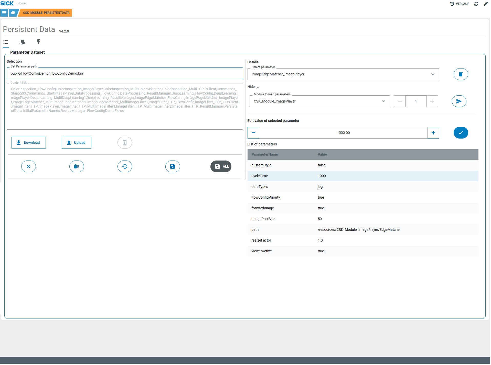

# CSK_Module_PersistentData

Module to provide data storage functionality. Can be used from other modules to load / save parameters.  

## How to Run

The app provides data storage functionality, incl. complex data types like Images, EdgeMatcher etc.  
There is also a GUI available.  
For further information regarding the internally used functions / events, check out the [documentation](https://raw.githack.com/SICKAppSpaceCodingStarterKit/CSK_Module_PersistentData/main/docu/CSK_Module_PersistentData.html) in the folder "docu".

## Information

Tested on  

|Device|Firmware|Module version|
|--|--|--|
|SICK AppEngine|v1.7.0|v4.1.0|
|SICK AppEngine|v1.5.0|v4.0.1|
|InspectorP631|v4.2.1|v4.0.1|
|SIM1012|v2.4.2|v4.1.0|
|SIM1012|v2.2.0|v4.0.0|

This module is part of the SICK AppSpace Coding Starter Kit developing approach.  
It is programmed in an object-oriented way. Some of these modules use kind of "classes" in Lua to make it possible to reuse code / classes in other projects.  
In general, it is not neccessary to code this way, but the architecture of this app can serve as a sample to be used especially for bigger projects and to make it easier to share code.  
Please check the [documentation](https://github.com/SICKAppSpaceCodingStarterKit/.github/blob/main/docu/SICKAppSpaceCodingStarterKit_Documentation.md) of CSK for further information.  

## Topics

Coding Starter Kit, CSK, Data, Persistent, Parameter, Storage, Module, SICK-AppSpace
